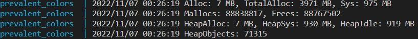

# PEX: Prevalent Colors Challenge
[](https://github.com/micheltraub/pex-prevalent-colors-challenge/actions/workflows/go.yml)
[](https://codecov.io/gh/micheltraub/pex-prevalent-colors-challenge)

---
- [PEX: Prevalent Colors Challenge](#pex-prevalent-colors-challenge)
  - [Running the application](#running-the-application)
  - [Challenge description](#challenge-description)
    - [First challenge requirement:](#first-challenge-requirement)
      - [Proposed solution](#proposed-solution)
    - [Second challenge requirement:](#second-challenge-requirement)
      - [Proposed solution](#proposed-solution-1)
  - [Results](#results)
    - [Running locally on dev computer](#running-locally-on-dev-computer)
    - [Running on Docker container (1 CPU and 512 MB)](#running-on-docker-container-1-cpu-and-512-mb)
  - [Improvements](#improvements)
  - [Extra](#extra)
    - [Converting CSV result into HTML](#converting-csv-result-into-html)

---

## Running the application
This application can be launched with **Go 1.9**, locally:
```shell
go mod download 
go run cmd/app/main.go
```

or using Docker compose:
```shell
docker-compose up --build --attach prevalent-colors
```

---
## Challenge description

### First challenge requirement:
>Below is a list of links leading to an image. Read this list of images and find the 3 most prevalent colors in the RGB scheme in >hexadecimal format (#000000 - #FFFFFF) for each image, then write the result into a CSV file in the form of url,color,color,color.

#### Proposed solution
To configure the input location, the input filename, the output location, and the output filename you can change the `.env` file modifying the following default values:

```dosini
#INPUT Location
INPUT_PATH=./test/data/
INPUT_FILENAME=input1000.txt

#OUTPUT location
OUTPUT_PATH=./out/
CSV_OUTPUT_FILENAME=colors_output.csv
```
The application exposes two different strategies to calculate the 3 most prevalent colors:

- **ACCURATE**: counts the HEX code of all colors in an image, and shows the 3 that repeats the most.
- **AVERAGE**: uses *k-means clustering* to calculate the prevalent colors (TODO: not implemented yet)

Internally, this has been achieved by defining a `PrevalentColor` *interface* with one implementation per strategy.

To change the calculation strategy you can edit the `.env` file, changing the following:
```dosini
#Calculating prevalent colors mode: ACCURATE or AVERAGE
PREVALENT_MODE=ACCURATE
```
To better performance (especially when processing larger images), it's possible to downscale the images before calculating the prevalent colors. Enabling this optimizes processing speed. However, even though the colors ratio is maintained after downscaling, the accuracy may be affected. This can be enabled with the `DOWNSCALE_IMAGES` flag in the `.env` file:
```dosini
#Reducing image improve performance but lose accuracy
DOWNSCALE_IMAGES=true
```
### Second challenge requirement:
>Please focus on speed and resources. The solution should be able to handle input files with more than a billion URLs using limited >resources (e.g., 1 CPU, 512MB RAM). Keep in mind that there is no limit on the execution time, but make sure you are utilizing the >provided resources as much as possible at any time during the program execution. 

#### Proposed solution
For every input *URL*, a `goroutine` is spawned to execute a processing *pipeline* that fetches the image, and that calculates the 3 most prevalent colors from it. Using **goroutines** allows concurrent processing, and the results are sent to a `csvLine` **channel**. The values received through that channel are written to a CSV file.

This approach leverages *concurrent processing* through the use of goroutines, allowing faster processing. However, this uses all the available resources.

Below some **CPU** and **memory** usage.

---

## Results

To enable **CPU** and **memory** monitoring, set the following variables in the `.env` file:
```dosini
#MONITORING for performance
ENABLE_CPU_MONITOR=true
ENABLE_MEMORY_MONITOR=true
CPU_PPROF_FILENAME=cpu.pprof
```

To set memory limit, set the following variables in the `.env` file (Default 512 MB - 0 wont limit the memory usage):
```dosini
MEMORY_LIMIT=512
```

### Running locally on dev computer

Processing `test/data/input100.txt`: 
  
| Downscale | Process time | Memory | *CPU | 
|--|:-------------:|:-------------:|:-------------:| 
| true  |  Process took 18.3562713s  |  |  | 
| false | Process took 2m47.0733879s |  |  | 

### Running on Docker container (1 CPU and 512 MB)

Processing `test/data/input100.txt`: 
  
| Downscale | Process time | Memory | *CPU | 
|--|:-------------:|:-------------:|:-------------:| 
| true  |   Process took 33.9286117s  |  |  | 
| false |  Process took 2m58.2547825s |  |  | 

*To get the CPU PPROF top10 information run: `go tool pprof cpu.pprof` and after that `top10`

## Improvements
As I am new in GO I had to learn many things, so I didnt had the time to do all that I wanted to do. So my goal was to apply some concepts that I know but are important but there are many things that are incomplete or that could be improved. Here is a list of things that I would do:

- Implement the average prevalent color calcuation using KMeans Clustering
- Limit the number of goroutines using things like runtime.NumCPU() and concurrency best practices (https://go.dev/blog/pipelines)
- Improve Error handler: create error types
- Add log level management
- Improve test coverage
- Reorganize my code following go project structure and som refactor using best practices (double checking naming conventions, dependecy injections, apply some patterns, etc...). Some references:
    - https://github.com/golang-standards/project-layout
    - https://golangbyexample.com/all-design-patterns-golang/
    - https://go.dev/blog/pipelines
    - https://go.dev/doc/diagnostics    
- The challenge was to use a CSV file as output, but in the future could use a database as output

---
## Extra
### Converting CSV result into HTML
The app has the capability to convert the *CSV* result into a static *HTML* file, to give a visual preview of the imagens and prevalent colors.

By default its already enabled. You can change the configs in the `.env` file modifying the following:
```shell
GENERATE_HTML=true
HTML_TEMPLATE_FILENAME=./web/templates/result.tmpl
HTML_OUTPUT_FILENAME=index.html
```
When enabled, the HTML page should open automatically in the browser after the program ends if running locally (not in Docker container).